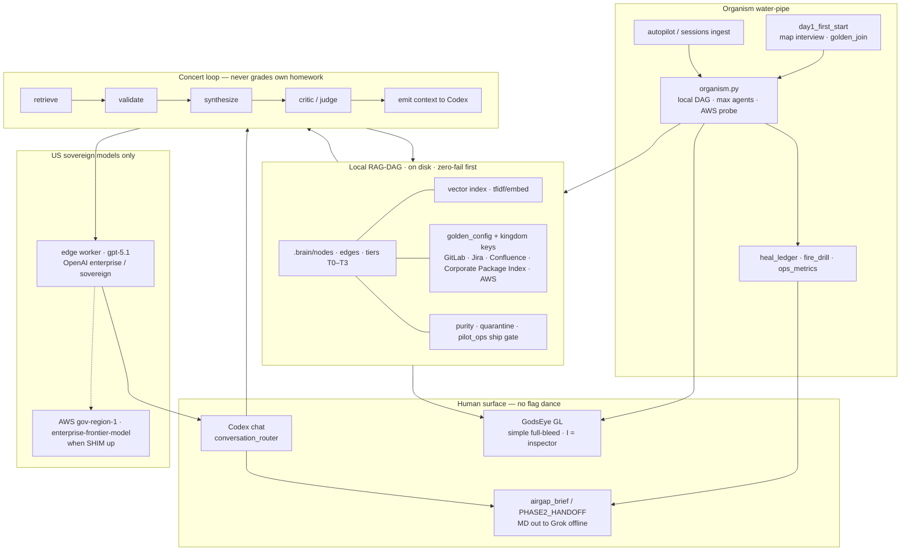
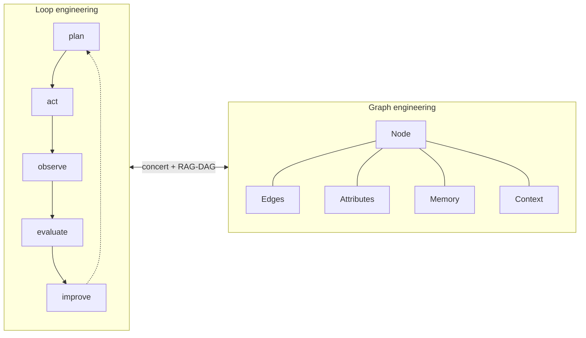

# Private Brain — One picture

**Open this first.** Two layers. Same system.

| You are… | Read |
|----------|------|
| **Anyone** (5 minutes) | **Layer A** only |
| **Senior engineer** | **Layer A** then **Layer B** |

No mermaid tool? Use the ASCII in Layer A — it always works in Notepad.

---

## Layer A · Anyone

### The whole product in one line

```text
  You talk  →  Private Brain remembers  →  Codex answers with proof  →  GodsEye shows the map
```

### The water pipe (what actually runs)

```text
 ┌─────────────┐    ┌──────────────┐    ┌────────────────┐    ┌─────────────┐
 │  1. START   │ →  │  2. MAP      │ →  │  3. LOCAL BRAIN │ →  │  4. EVERY DAY│
 │  once       │    │  interview   │    │  graph + search │    │  beastMode   │
 │  START.ps1  │    │  packages ·  │    │  on THIS PC     │    │  open Codex  │
 │             │    │  GitLab/Jira │    │  no cloud req.  │    │  just talk   │
 └─────────────┘    │  Confluence  │    └────────────────┘    └──────┬──────┘
                    │  AWS probe   │                                 │
                    └──────────────┘                                 ▼
                                                    ┌────────────────────────────┐
                                                    │  YOU TYPE IN CODEX CHAT    │
                                                    │  "fix the auth bug"       │
                                                    │  "fire drill"              │
                                                    │  "show GodsEye"            │
                                                    └────────────┬───────────────┘
                                                                 │
                    ┌────────────────────────────────────────────┼────────────────┐
                    ▼                                            ▼                ▼
           ┌────────────────┐                         ┌────────────────┐  ┌──────────────┐
           │  REMEMBER      │                         │  ANSWER        │  │  SEE         │
           │  sessions +    │                         │  cite-or-block │  │  GodsEye     │
           │  tickets +     │                         │  or say "I     │  │  dots =      │
           │  wiki on disk  │                         │  don't know"   │  │  knowledge   │
           └────────────────┘                         └────────────────┘  └──────────────┘
```

### What you touch vs what you ignore

| You touch | You ignore (it just works) |
|-----------|----------------------------|
| `START.ps1` once | flags, YAML, model routers |
| `beastMode` daily | heal ledger, purity, DAG |
| **talk in Codex** | concert stages, vector index |
| **I** in GodsEye only if curious | metrics, FPS, lod |

### GodsEye (the picture on screen)

```text
  ┌──────────────────────────────────────────────────────────┐
  │  ● Healthy                              I details        │
  │                                                          │
  │              ·  ··· ·    ·                               │
  │            · ······· · ·                                 │
  │              · · · ·                                     │
  │                                                          │
  │         (full-bleed map of YOUR brain)                   │
  │                                                          │
  │              ┌─ click a dot ─┐                           │
  │              │ short title   │                           │
  │              │ type · source │                           │
  │              └───────────────┘                           │
  └──────────────────────────────────────────────────────────┘

  drag = move · scroll = zoom · click = select · I = engineer panel · Q = quit
```

### Failure modes in plain English

| Symptom | Do this |
|---------|---------|
| Install asks about packages | Pick **corporate-library** at Corporate, **headless** if offline |
| Codex doesn't know your tickets | Say nothing special — next `beastMode` ingests sessions; map GitLab/Jira on day-1 |
| GodsEye won't open | Headless route or missing GL packages — chat still works |
| Answer has no proof | Good — cite-or-block refused to invent. Fix sources, not the model. |

---

## Layer B · Senior engineers

### Architecture (US sovereign only)



### Loop + graph (same system, two disciplines)



### Data plane (what seniors debug)

```text
  %USERPROFILE%\.codex\private-brain\          ← LIVE sideload
  ├─ scripts\          beastMode · organism · conversation_router · fire_drill
  ├─ hooks\            session_start · user_prompt_submit · stop_validate
  ├─ visualizer\       graph_gl.py  (GodsEye · Apple-simple default)
  ├─ config\           enterprise · model_routing · judge_*_policy
  └─ .brain\           corpus (never in the zip)
       ├─ graph\snapshot.json
       ├─ index\embeddings\
       ├─ state\godseye_*.json · golden_config · heal_ledger · ops_metrics
       └─ nodes\ · edges\ · content\

  Zip ships CODE only. Brain grows on the laptop after START.
```

### Control plane rules

| Rule | Implementation |
|------|----------------|
| Zero-fail local first | core stdlib; GodsEye optional from Corporate Library / Protected Gateway `PIP_INDEX_URL` |
| No public model path | gpt-5.1 edge · GSS 120B AWS · **not** Kimi/Opus |
| Cite-or-block | concert emit refuses ungrounded answers |
| Ship gate | `pilot_ops` / quarantine coverage — not “looks green” theater |
| Full access | enterprise `danger-full-access` + hook inject; talk not flags |
| Dual OS | same package model; this zip is **windows/** only |
| Air-gap parent | day brief MD for Grok; no online Grok at work |

### GodsEye vs Inspector

```text
  DEFAULT (simple)              I → INSPECTOR (ops)
  ─────────────────             ────────────────────
  full-bleed constellation      STATUS · STAGES LEDs
  health pill                   VECTOR · METRICS
  floating selection sheet      EVIDENCE dual-pane
  scissor = no window bleed     ACTIVITY / GPU path
```

### Monday path (senior checklist)

```text
  1. Quit Codex
  2. Expand PrivateBrain-WINDOWS-READY.zip
  3. .\START.ps1          → map + sideload + organism
  4. beastMode            → wake + Codex
  5. Talk                 → concert uses local graph
  6. Optional: fire drill / show metrics / show GodsEye
  7. day brief            → MD handoff if parent model is offline Grok
```

### Threat / trust boundaries

```mermaid
flowchart LR
  subgraph ONBOX["On laptop — trusted"]
    PB[Private Brain sideload]
    CORPUS[.brain corpus]
    GE2[GodsEye process]
  end
  subgraph APPROVED["Approved network only"]
    Corporate Library[Corporate Library / Protected Gateway pip index]
    GL[GitLab/Jira/Confluence]
    GOV[AWS gov-region-1 SHIM]
  end
  subgraph NEVER["Never on work path"]
    PUB[public PyPI as primary]
    FOSS[Kimi / Claude Opus / random SaaS]
  end
  PB --> CORPUS
  PB --> GE2
  PB -.->|optional| Corporate Library
  PB -.->|kingdom keys| GL
  PB -.->|when configured| GOV
  PB -.-x NEVER
```

---

## One-screen cheat (print / pin)

```text
┌────────────────────────────────────────────────────────────────────────┐
│  PRIVATE BRAIN · WINDOWS                                               │
│                                                                        │
│  ONCE:   .\START.ps1                                                   │
│  DAILY:  beastMode                                                     │
│  WORK:   talk in Codex                                                 │
│  SEE:    GodsEye  (I = details)                                        │
│                                                                        │
│  BRAIN = local graph on disk                                           │
│  ANSWER = cite or refuse                                               │
│  MODEL  = gpt-5.1 sovereign · GSS 120B gov when live                   │
│  SHIP   = pilot_ops green · secrets store only · no tokens in chat     │
└────────────────────────────────────────────────────────────────────────┘
```

---

*Diagram ships at the root of the Windows zip. Code + brain details: `package/README.md`, `package/docs/`.*
