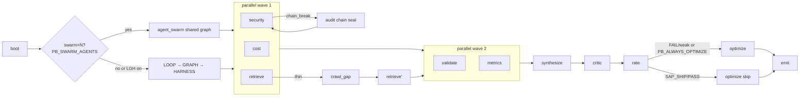
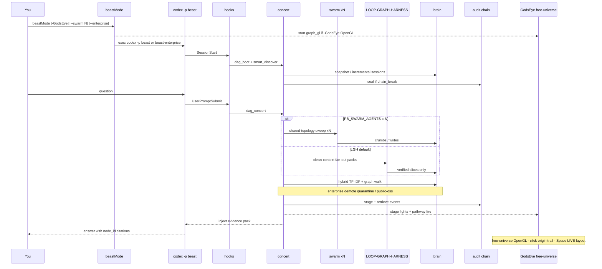
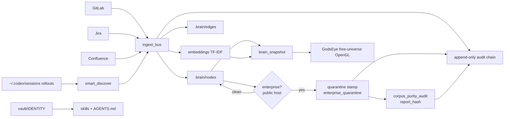
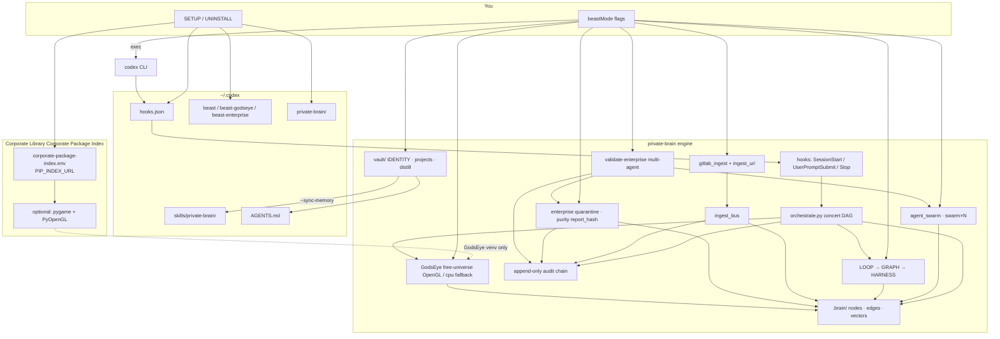
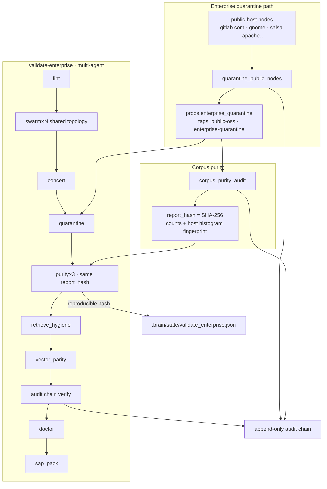
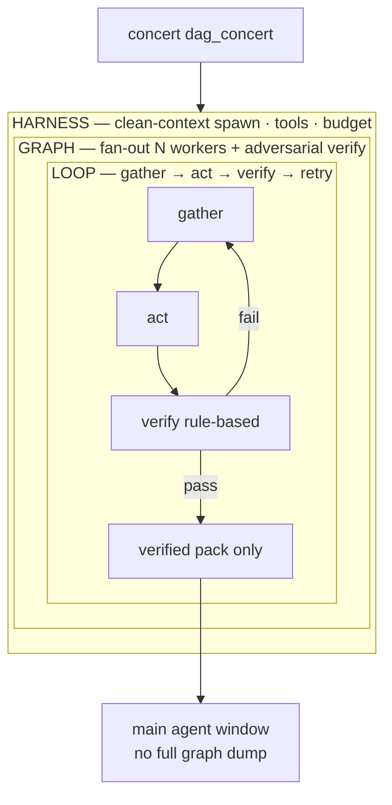
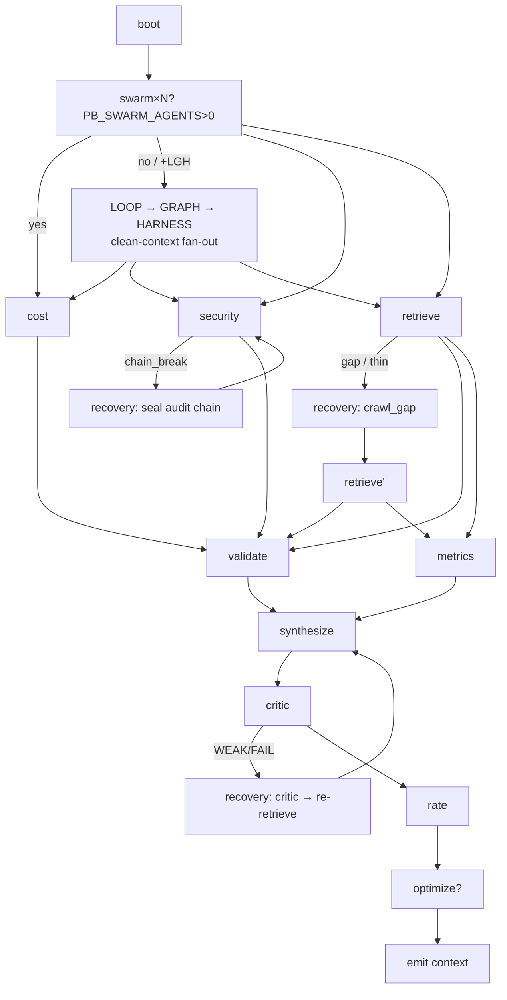
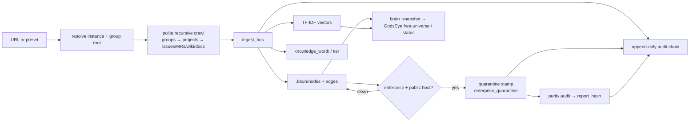
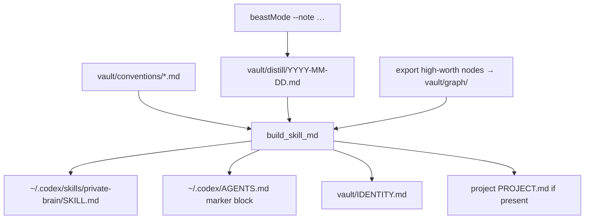

# Private Brain — Codex Sideload

> **Start here:** [`START_HERE.md`](START_HERE.md) — **Anyone** + **Senior**  
> **Picture:** [`docs/DIAGRAM.md`](docs/DIAGRAM.md) · **GodsEye:** [`docs/GODSEYE_HELP.md`](docs/GODSEYE_HELP.md) · **Index:** [`docs/INDEX.md`](docs/INDEX.md)

**You never run Python. Only `SETUP` / `beastMode` / `UNINSTALL`.**

**Private Brain is a Codex SIDELLOAD only — never a product CLI.**  
It is meant to be an **organism**, not a spider web of flags.

### The only loop that matters

| When | What you type |
|------|----------------|
| **Once** | `START.ps1` (Windows) / `START.command` (Mac) |
| **Every day** | `beastMode --enterprise` |
| **In Codex** | Talk. Retrieve + cite-or-block is automatic. |

**`beastMode --enterprise` runs AUTOPILOT** (unless `--no-autopilot`):  
sessions harvest → capabilities self-repair → heal-if-hurt → quarantine public → optional crawl if URLs set → distill skills → ops metrics → open Codex.

You should **almost never** hand-run `--heal` / `--doctor` / `--mission` / `--metrics`.  
Those exist for forensics and scream tests (`--fire-drill`, `--autopilot`).

**GodsEye is optional.** Headless is the default.  
**Corporate / work = Windows.** Mac is home-lab only.

| Where | What |
|-------|------|
| **PowerShell** | Install once · daily `beastMode --enterprise` |
| **Codex** | Questions / concerts — not install |
| **File Explorer** | Extract zip → **`windows\`** only |
| **AppGate** | Before first internal crawl (optional) |
| **Never** | A 12-step command parade for day-to-day work |

Full mission design: **`MISSION_MONDAY.md`**. Autopilot report: `.brain/state/autopilot.json`.

---

## Monday morning TODO — Windows (Corporate work laptop)

**Short path (preferred):** restore sessions → `START.ps1` → `beastMode --enterprise` → talk in Codex.

Long form below is only if you want the manual map. Zero-fail = local RAG green first; missing Corporate Library/AWS/Jira = **soft**.

**Have ready (optional but powerful):** Corporate Library URL, GitLab/Jira/Confluence + tokens, AppGate, AWS SHIM when data plane exists.

---

### Step 0 — Backup Codex sessions

**Where: PowerShell** — not Codex.

```powershell
# Close Codex / ChatGPT Desktop first
$stamp = Get-Date -Format "yyyyMMdd-HHmmss"
$backup = Join-Path $env:USERPROFILE "Desktop\codex-sessions-backup-$stamp"
New-Item -ItemType Directory -Force -Path $backup | Out-Null
if (Test-Path "$env:USERPROFILE\.codex\sessions") {
  Copy-Item -Recurse -Force "$env:USERPROFILE\.codex\sessions" $backup\
  Write-Host "Backed up sessions → $backup"
} else {
  Write-Host "No sessions folder yet — skip or note empty"
}
# Optional (you own it; policy permitting):
# Copy-Item "$env:USERPROFILE\.codex\auth.json" $backup\ -ErrorAction SilentlyContinue
```

**Checklist:** [ ] `%USERPROFILE%\.codex\sessions` copied to Desktop (or approved drive)

---

### Step 1 — Clean reinstall Codex (product only)

**Where: Windows Installer** — not PowerShell required; not Codex chat.

1. **Quit Codex / ChatGPT Desktop completely** (task manager if needed). Reinstall with Codex open leaves stale hooks.
2. Uninstall old Codex / ChatGPT Desktop Codex (company process).
3. Install current approved Codex build.
4. Open once so `%USERPROFILE%\.codex` is created, then quit.

**Checklist:** [ ] Codex fully quit before uninstall [ ] Codex opens [ ] `%USERPROFILE%\.codex` exists

---

### Step 2 — Restore sessions

**Where: PowerShell** — not Codex.

```powershell
# Point at the backup you made in Step 0 (edit the folder name)
$backup = "$env:USERPROFILE\Desktop\codex-sessions-backup-YYYYMMDD-HHMMSS"
New-Item -ItemType Directory -Force -Path "$env:USERPROFILE\.codex" | Out-Null
Copy-Item -Recurse -Force "$backup\sessions" "$env:USERPROFILE\.codex\"
Write-Host "Restored sessions → $env:USERPROFILE\.codex\sessions"
```

**Checklist:** [ ] Sessions under `%USERPROFILE%\.codex\sessions`

---

### Step 3 — Get Private Brain kit on the machine

**Where: Email / approved share + File Explorer** — not Codex.

1. Download `PrivateBrain-CORPORATE-*.zip`.
2. Extract to a short path (e.g. `C:\Work\PrivateBrain`).
3. Open the **`windows\`** folder only (ignore `mac\`):

```text
PrivateBrain-CORPORATE-<UTC>\
  README.md
  windows\          ← YOU ARE HERE (work)
    START.ps1
    SETUP.ps1
    SETUP.cmd
    package\
  mac\              ← ignore at Corporate
```

**Checklist:** [ ] Zip extracted [ ] You are inside `windows\`

---

### Step 4 — Single-file install (sideload)

**Where: PowerShell** — **not Codex**.

```powershell
cd C:\Work\PrivateBrain\PrivateBrain-CORPORATE-*\windows   # edit path

# Preferred one-shot day-1 (map + install + heal path):
powershell -NoProfile -ExecutionPolicy Bypass -File .\START.ps1

# Install only (if you already ran map):
# powershell -NoProfile -ExecutionPolicy Bypass -File .\SETUP.ps1

# Corporate wrapper if present in kit:
# .\Install-PrivateBrain.ps1
```

Put `beastMode` on PATH if SETUP did not:

```powershell
$env:Path = "$env:USERPROFILE\bin;" + $env:Path
# permanent (user scope):
[Environment]::SetEnvironmentVariable(
  "Path",
  "$env:USERPROFILE\bin;" + [Environment]::GetEnvironmentVariable("Path", "User"),
  "User"
)
```

Open a **new** PowerShell window and confirm:

```powershell
beastMode --help
```

**Checklist:** [ ] `beastMode --help` works

---

### Step 5 — Interview A: Corporate Library + identity (packages)

**Where: PowerShell** (wizard inside `START.ps1` / `beastMode --day1`).  
Secrets land in local `day1.env` — **never commit**.

| Prompt | Notes |
|--------|--------|
| Program id / classification | Your pilot program |
| **Corporate Library / PIP_INDEX_URL** | Package index — **not** the same as GitLab token |
| **PIP_TRUSTED_HOST** | Corporate Library host |
| GodsEye later? | Default **N** (headless is OK) |

No Corporate Library yet? Core RAG still works **headless**. GodsEye needs pygame/PyOpenGL from Corporate Library when available.

**Manual env (only if you skip the wizard):**

```powershell
$env:PB_ENTERPRISE = "1"
$env:PIP_INDEX_URL = "https://YOUR-Corporate Library-HOST/.../simple"
$env:PB_PIP_INDEX_URL = $env:PIP_INDEX_URL
$env:PIP_TRUSTED_HOST = "YOUR-Corporate Library-HOST"
$env:PB_PIP_TRUSTED_HOST = $env:PIP_TRUSTED_HOST
$env:PB_PIP_REQUIRE_ARTIFACTORY = "1"
```

**Checklist:** [ ] Corporate Library set **or** conscious headless choice

---

### Step 6 — Day-1 + sessions first + heal → LOCAL_READY

**Where: PowerShell** — not Codex chat.

```powershell
# Full day-1 (board → map → sessions harvest → heal → doctor → mission)
beastMode --day1

# Or after install, gates only:
beastMode --mission

# Or explicit:
beastMode --enterprise --heal
beastMode --enterprise --doctor
beastMode --mission
```

**Hard green required:**

| Gate | Meaning |
|------|---------|
| hooks / profile | sideload live |
| audit chain | ok |
| vector parity | nodes == vectors |
| doctor hard fails | empty |

**Soft (OK Monday morning):** no GitLab yet, no AWS yet, `pilot_ready` false until internal re-ingest.

**Checklist:** [ ] `beastMode --mission` shows local ready [ ] doctor hard fails empty

---

### Step 7 — Interview B: GitLab / Jira / Confluence (+ AppGate)

**Where:**

1. **AppGate** (company app) — connect first — not PowerShell, not Codex.  
2. **PowerShell** — URLs + tokens + crawl.

```powershell
# After AppGate is connected:
$env:PB_GITLAB_URL = "https://gitlab.your.corp/your/group"
$env:GITLAB_TOKEN = "glpat-..."              # never commit
$env:PB_JIRA_URL = "https://jira.your.corp"
$env:JIRA_TOKEN = "..."                      # if used
$env:PB_CONFLUENCE_URL = "https://confluence.your.corp/wiki"
$env:CONFLUENCE_TOKEN = "..."                # if used
$env:PB_APPGATE_OK = "1"
$env:PB_ENTERPRISE = "1"

beastMode --day1
# or if DAY1.ps1 is in the kit:
# powershell -NoProfile -ExecutionPolicy Bypass -File .\scripts\DAY1.ps1

# Ops hygiene:
beastMode --enterprise --quarantine-public
beastMode --mission
```

**Checklist:** [ ] AppGate up [ ] at least GitLab URL+token [ ] crawl attempted [ ] `pilot_ops_ready` true

---

### Step 8 — Interview C: AWS SHIM (only after LOCAL_READY)

**Where: PowerShell** — not Codex.  
Do **not** block local work if AWS is not ready yet.

```powershell
$env:AWS_PROFILE = "your-gov-profile"
$env:AWS_DEFAULT_REGION = "gov-region-1"
$env:PB_AWS_REGION = "gov-region-1"
# After SSM port-forward is up (company SHIM docs):
$env:PB_LLM_BASE_URL = "http://127.0.0.1:8443/v1"
$env:PB_OPENSEARCH_ENDPOINT = "https://your-opensearch..."
$env:PB_NEPTUNE_ENDPOINT = "wss://your-neptune...:8182/gremlin"   # or https form
# optional:
# $env:PB_BEDROCK_REGION = "gov-region-1"
# $env:PB_MODEL_PREFERENCE = "nova-pro"

beastMode --mission
# 401/403 on OpenSearch often still means "reachable"
```

**Checklist:** [ ] LOCAL_READY already true [ ] SHIM URL set when cloud is ready

---

### Step 9 — Open Codex and work

**Where: PowerShell first (starts sideload), then Codex chat.**

```powershell
beastMode --enterprise
# execs: codex -p beast-enterprise
```

Or open **ChatGPT Desktop / Codex** and select profile **beast-enterprise**.

**Type these in Codex (chat) — not in PowerShell:**

| Goal | Paste / say in **Codex** |
|------|--------------------------|
| Concert over brain | `Run a Private Brain concert. Prefer non-public evidence. Cite node_ids.` |
| Use restored sessions | `Use my restored Codex sessions and the RAG-DAG. Cite nodes.` |
| Thin evidence | `Evidence is thin — crawl internal GitLab/Jira/Confluence under enterprise policy.` |
| Plan / code | `Planning assistant — cite nodes.` / `Code assistant — brain evidence only.` |

**Health / heal stay in PowerShell** (not chat):

```powershell
beastMode --enterprise --doctor
beastMode --enterprise --heal
beastMode --mission
```

**Checklist:** [ ] Talking to Codex [ ] enterprise answers cite node_ids

---

### Step 10 — Optional GodsEye (Live Ops)

**Where: PowerShell** — needs pygame (+ PyOpenGL for TRUE GL) from Corporate Library.

```powershell
beastMode --enterprise -GodsEye
# if GL packages missing on Corporate Library:
beastMode --enterprise --GodsEye-cpu
```

**Checklist:** [ ] HUD open **or** headless on purpose

---

### Step 11 — If anything is red (self-heal loop)

**Where: PowerShell**

```powershell
beastMode --enterprise --heal
beastMode --enterprise --doctor
beastMode --mission
# still hard-red?
beastMode --enterprise --validate-enterprise
```

Repeat until **hard** fails are empty. Soft warnings (no Corporate Library, no AWS, public_ratio) do **not** stop local pilot work.

---

### Monday checklist (Windows — print this)

| # | Step | Where | Done |
|---|------|--------|------|
| 0 | Backup `%USERPROFILE%\.codex\sessions` | **PowerShell** | [ ] |
| 1 | Reinstall Codex | **Windows installer** | [ ] |
| 2 | Restore sessions | **PowerShell** | [ ] |
| 3 | Extract zip → open **`windows\`** | **File Explorer** | [ ] |
| 4 | `START.ps1` or `SETUP.ps1` | **PowerShell** | [ ] |
| 5 | Interview A — Corporate Library + program | **PowerShell** (wizard) | [ ] |
| 6 | `beastMode --day1` / `--mission` → LOCAL_READY | **PowerShell** | [ ] |
| 7 | AppGate + GitLab/Jira/Confluence crawl | **AppGate** + **PowerShell** | [ ] |
| 8 | Quarantine + `pilot_ops_ready` | **PowerShell** | [ ] |
| 9 | Interview C — AWS SHIM (when ready) | **PowerShell** | [ ] |
| 10 | **`beastMode --enterprise`** (autopilot wakes organism) | **PowerShell** then **Codex** | [ ] |
| 11 | Optional scream: `--fire-drill` | **PowerShell** | [ ] |
| 12 | Optional `-GodsEye` | **PowerShell** | [ ] |

---

## Daily step-by-step (after Monday) — Windows

No Python. Install once → doctor → open Codex → talk.

### 1) Install once (if not already) — PowerShell

```powershell
cd path\to\kit\windows
powershell -NoProfile -ExecutionPolicy Bypass -File .\SETUP.ps1
# or: .\START.ps1
# or: beastMode --day1
```

### 2) Prove install — PowerShell

```powershell
beastMode --enterprise --heal
beastMode --enterprise --doctor
# pilot_ready soft-fail until internal re-ingest is fine
```

### 3) Open Codex — PowerShell then Codex

```powershell
beastMode --enterprise
# or: codex -p beast-enterprise
```

### 4) What to type in Codex (chat)

| You want | Say / paste in **Codex** |
|----------|--------------------------|
| Concert | `Run a Private Brain concert. Cite node_ids.` |
| Enterprise pilot | `Enterprise mode. Prefer non-public evidence. Hard cites.` |
| Session → graph | `Discover and ingest recent Codex sessions into the brain.` |
| Health | **PowerShell:** `beastMode --enterprise --doctor` |
| Validate | **PowerShell:** `beastMode --enterprise --validate-enterprise` |

### 5) beastMode cheatsheet — PowerShell only

| Command | What it does |
|---------|----------------|
| `beastMode` | Headless beast → Codex |
| `beastMode --enterprise` | Corporate profile → Codex |
| `beastMode -GodsEye` | + GodsEye Live Ops |
| `beastMode --GodsEye-cpu` | GodsEye software pygame if no GL |
| `beastMode --enterprise --doctor` | Health + purity ops |
| `beastMode --enterprise --heal` | Self-recover chain · vectors · capabilities |
| `beastMode --enterprise` | **DEFAULT** — autopilot + open Codex |
| `beastMode --autopilot` | Organism only (no Codex) — scoreboard |
| `beastMode --mission` | Forensics: Monday gates |
| `beastMode --fire-drill` | Scream test |
| `beastMode --metrics` | Forensics: ops JSON |
| `beastMode --day1` | Full day-1 interview path |
| `beastMode --no-autopilot` | Skip organism on launch |
| `beastMode --validate-enterprise` | Full E2E hard gates |
| `beastMode -ingestion URL --ingest-only` | Manual harvest (also auto if URL env set) |

### 6) GodsEye (optional — show the graph)

```bash
# packages from Corporate Library / Protected Gateway if you want GL (pygame + PyOpenGL). Missing? request onboard. Headless still works.
beastMode --enterprise -GodsEye
```

Or GUI only:

```bash
export PB_GODSEYE=1 PB_GODSEYE_BACKEND=gl
python3 ~/.codex/private-brain/scripts/godseye.py restart
```

**In the GodsEye window**

| Key | Action |
|-----|--------|
| **H** | Help |
| **Space** | Freeze ↔ live layout |
| **R** | Reseed free-universe islands |
| **S** | Reload snapshot + last concert DAG |
| **F** | Cycle source filter (gitlab/jira/…/local) |
| **T** or **1–4** / **5** | Tier filter / all |
| **E** | Light last concert **evidence path** (GraphRAG trail) |
| **L** | Source legend with counts |
| **N** | Expand 1-hop neighbors of selected node |
| Click | Origin trail / multi-hop pathway |
| **[ ]** | Walk trail |
| Drag / wheel | Pan / zoom |
| **0 / Home** | Camera fit |
| **Q / Esc** | Quit |

### 7) Internal crawl (Corporate — AppGate up)

```bash
# after AppGate is connected and tokens set:
beastMode --day1 --yes --route corporate-library --program YourProgram \
  --gitlab https://gitlab.your.internal/group \
  --jira https://jira.your.internal \
  --confluence https://confluence.your.internal/wiki
# or crawl only:
#   DAY1 --crawl-only --gitlab … --jira … --confluence …
```

### 8) Uninstall sideload (Codex stays)

```bash
bash UNINSTALL.command
# or: python3 ~/.codex/private-brain/scripts/uninstall_private_brain.py
```

---

## What to run (quick reference)

End users run only the commands below. Every row has **Mac/Linux (bash)** and **Windows (PowerShell)**.

### SETUP (install once)

**Mac / Linux (bash):**

```bash
cd /path/to/private-brain-codex
# optional Corporate Library index first — see Corporate Library Corporate Package Index below
bash SETUP.command
# or double-click SETUP.command
```

**Windows (PowerShell):**

```powershell
cd path\to\private-brain-codex
# optional Corporate Library index first — see Corporate Library Corporate Package Index below
powershell -NoProfile -ExecutionPolicy Bypass -File .\SETUP.ps1
# or double-click SETUP.cmd
# full corporate installer:
# .\Install-PrivateBrain.ps1 -Model "gpt-5.1"
```

### beastMode — headless (GodsEye OFF by default)

**Mac / Linux (bash):**

```bash
export PATH="$HOME/bin:$PATH"
beastMode                              # headless beast; self-heals hooks/brain
```

**Windows (PowerShell):**

```powershell
$env:Path = "$env:USERPROFILE\bin;" + $env:Path
beastMode                              # headless beast; self-heals hooks/brain
# launcher is also %USERPROFILE%\bin\beastMode.cmd
```

### beastMode -GodsEye (optional TRUE OpenGL)

TRUE OpenGL uses **pygame + PyOpenGL** (and **PyOpenGL-accelerate** when available). GPU draw is via an **OpenGL hardware context** (`visualizer/graph_gl.py`).

**Mac / Linux (bash):**

```bash
beastMode -GodsEye                     # TRUE OpenGL GodsEye (optional)
```

**Windows (PowerShell):**

```powershell
beastMode -GodsEye                     # TRUE OpenGL GodsEye (optional)
```

### PB_GODSEYE_BACKEND=cpu fallback

Use when PyOpenGL is missing from Corporate Library, GL init fails, or policy allows only pygame.

**Mac / Linux (bash):**

```bash
PB_GODSEYE_BACKEND=cpu beastMode -GodsEye
# or:
beastMode --GodsEye-cpu
```

**Windows (PowerShell):**

```powershell
$env:PB_GODSEYE_BACKEND = "cpu"
beastMode -GodsEye
# or:
beastMode --GodsEye-cpu
```

### beastMode --enterprise --doctor

**Mac / Linux (bash):**

```bash
beastMode --enterprise --doctor        # READY + enterprise checks
```

**Windows (PowerShell):**

```powershell
beastMode --enterprise --doctor        # READY + enterprise checks
```

### beastMode --enterprise --heal

**Mac / Linux (bash):**

```bash
beastMode --enterprise --heal          # self-recover profile · chain · vectors · snapshot
```

**Windows (PowerShell):**

```powershell
beastMode --enterprise --heal          # self-recover profile · chain · vectors · snapshot
```

### SAP pack

**Mac / Linux (bash):**

```bash
beastMode --enterprise --sap-pack
# → ~/.codex/private-brain/.brain/audit/packs/sap-pack-*.zip
```

**Windows (PowerShell):**

```powershell
beastMode --enterprise --sap-pack
# → %USERPROFILE%\.codex\private-brain\.brain\audit\packs\sap-pack-*.zip
```

### beastMode --enterprise --purity-audit

Reproducible public-host purity report. Same graph → same **`report_hash`** (counts only).

```bash
beastMode --enterprise --purity-audit
# → .brain/state/corpus_purity.json · audit event with report_hash
# → pilot_ops_ready (quarantine+retrieve hygiene) vs pilot_ready (raw purity)
```

### beastMode --enterprise --quarantine-public

Stamp public-host nodes for retrieve demotion. **Does not delete** knowledge.

```bash
beastMode --enterprise --quarantine-public
# → props.enterprise_quarantine + tags; re-runs purity audit
```

### beastMode --enterprise --validate-enterprise

Multi-agent E2E with reproducible purity hash equality (default swarm ×16).

```bash
beastMode --enterprise --validate-enterprise
# → lint · swarm×16 · concert · quarantine · purity×3 · retrieve hygiene ·
#   vector parity · audit chain · doctor · sap-pack
# → .brain/state/validate_enterprise.json · audit log (report_hash)
# Exit 0 = hard ops gates (pilot_ops_ready path). pilot_ready is soft.
```

### START_AT_CORPORATE (day-1 preferred)

**Mac / Linux (bash):**

```bash
cd /path/to/private-brain-codex
cp corporate-package-index.env.example corporate-package-index.env   # set Corporate Library PIP_INDEX_URL
# edit corporate-package-index.env, then:
source ./corporate-package-index.env                     # optional if GodsEye / pygame needed
chmod +x START_AT_CORPORATE.command scripts/start_at_corporate
./START_AT_CORPORATE.command
# or non-interactive:
./scripts/start_at_corporate --yes --program MyProgram --hosts gitlab.corp.internal
```

**Windows (PowerShell):**

```powershell
cd path\to\private-brain-codex
Copy-Item corporate-package-index.env.example corporate-package-index.env
# edit corporate-package-index.env, then load PIP_INDEX_URL / PIP_TRUSTED_HOST into the session
powershell -NoProfile -ExecutionPolicy Bypass -File .\START_AT_CORPORATE.ps1
# non-interactive:
.\scripts\start_at_corporate.ps1 -Program MyProgram -Hosts "gitlab.corp.internal"
```

Docs: **`START_AT_CORPORATE.md`** · **`CORPORATE_PACKAGE_INDEX.md`**

### Corporate Library Corporate Package Index env

Point pip at the approved Corporate Library PyPI remote **before** SETUP if you need GodsEye packages. Core RAG-DAG remains **stdlib only** and does not require Corporate Package Index.

**Mac / Linux (bash):**

```bash
cp corporate-package-index.env.example corporate-package-index.env
# edit PIP_INDEX_URL / PIP_TRUSTED_HOST to your Corporate Library remote
source ./corporate-package-index.env
export PB_ENTERPRISE=1
export PB_PIP_REQUIRE_ARTIFACTORY=1
# SETUP / START_AT_CORPORATE will install pygame + PyOpenGL from that index only
bash SETUP.command
```

**Windows (PowerShell):**

```powershell
Copy-Item corporate-package-index.env.example corporate-package-index.env
# edit PIP_INDEX_URL / PIP_TRUSTED_HOST, then:
$env:PIP_INDEX_URL = "https://…corporate-library…/corporate-package-index/api/pypi/…/simple"
$env:PIP_TRUSTED_HOST = "…corporate-library…"
$env:PB_PIP_INDEX_URL = $env:PIP_INDEX_URL
$env:PB_PIP_TRUSTED_HOST = $env:PIP_TRUSTED_HOST
$env:PB_ENTERPRISE = "1"
$env:PB_PIP_REQUIRE_ARTIFACTORY = "1"
powershell -NoProfile -ExecutionPolicy Bypass -File .\SETUP.ps1
```

### Other common flags (bash / PowerShell same flag names)

```bash
beastMode --enterprise                 # Corporate pilot (Corporate Library deps via PIP_INDEX_URL — not offline)
beastMode --enterprise --doctor        # READY + enterprise checks
beastMode --enterprise --heal          # self-recover profile · chain · vectors · snapshot
beastMode --enterprise --sap-pack      # SAP evidence zip
beastMode --enterprise --purity-audit  # report_hash · pilot_ops_ready vs pilot_ready
beastMode --enterprise --quarantine-public
beastMode --enterprise --validate-enterprise   # multi-agent E2E + hash audit log
beastMode --swarm 32                   # 32 agents · one shared graph · no queue
beastMode -ingestion <URL> --max       # DEEP polite recursive GitLab crawl → graph
beastMode --note "Tried X. Worked."    # daily distill → vault
beastMode --sync-memory                # vault → skills / AGENTS.md
beastMode --pipeline                   # LOOP→GRAPH→HARNESS offline proof
beastMode --pipeline brain             # RAG fan-out with clean child contexts
beastMode --never-forget-init          # vault/IDENTITY.md + projects/ + skills/
beastMode --doctor                     # health check → READY / FAIL
```

---

## How it works — sideload architecture

Private Brain does **not** replace the `codex` binary and is **never** a standalone product CLI. Install copies the engine under `~/.codex/private-brain`, wires **hooks** + **beast profiles**, and drops a thin launcher `beastMode` that:

1. Parses feature flags (optional **GodsEye** via `-GodsEye`, swarm, ingestion, note, sync-memory, nuclear, enterprise, …)
2. Optionally runs internal Python (ingest / GUI / distill) **for you**
3. **`exec`s** `codex --dangerously-bypass-hook-trust -p beast|beast-godseye|beast-enterprise`

You never type `python`. Hooks fire inside Codex sessions. Knowledge lives on disk under `.brain/`. **GodsEye stays off** unless you pass **`-GodsEye`**.

---

## Where we are today (2026-07-25)

**Status: production sideload — doctor READY · E2E SAP_SHIP.**

| Metric | Value |
|--------|------:|
| Nodes / edges | **5320 / 6424** |
| Vectors (TF-IDF, 1:1) | **5320** · vocab ~67k |
| Sources | gitlab 2491 · brain 1717 · jira 460 · codex_session 352 · metrics 176 · confluence 121 |
| Last full concert | `final_ok=true` · critic **PASS 10/10** · rate **SAP_SHIP 10/10** · swarm **16/16** · optimize **ok** |
| All scoreboard lights | green (incl. content-weighted `knowledge_quality`) |

### Architecture (current)

```mermaid
flowchart TB
  subgraph You["You — zero Python"]
    BM["beastMode · SETUP · UNINSTALL · DAY1"]
  end

  subgraph Approved["Approved package sources — Corporate"]
    Corporate Library["Corporate Library Corporate Package Index"]
    Protected Gateway["Protected Gateway repos"]
    PIP["PIP_INDEX_URL / PIP_TRUSTED_HOST"]
    REQ["Request package onboard if missing"]
    Corporate Library --> PIP
    Protected Gateway --> PIP
    PIP -.-> REQ
  end

  subgraph Host["Codex host"]
    CX["ChatGPT.app → codex CLI"]
  end

  subgraph Edge["AppGate ZTNA"]
    AG["AppGate SDP"]
    SRC["GitLab · Jira · Confluence"]
    AG --> SRC
  end

  subgraph PB["~/.codex/private-brain sideload only"]
    direction TB
    H["hooks SessionStart / Prompt / Stop"]
    O["orchestrate.py concert DAG"]
    SW["agent_swarm shared topology"]
    LGH["LOOP → GRAPH → HARNESS"]
    SD["smart_discover sessions"]
    IB["ingest_bus"]
    IN["gitlab_ingest / ingest_url"]
    IC["internal_crawl_swarm polite multi-agent"]
    VM["vector_manager TF-IDF"]
    G[".brain nodes · edges · vectors"]
    AC["append-only audit chain"]
    ENT["enterprise quarantine · rank_evidence"]
    PUR["corpus purity · report_hash"]
    VAL["validate-enterprise · doctor · sap"]
    COC["config_of_config → DAY1 map"]
    V["vault IDENTITY · projects"]
    GE["GodsEye optional OpenGL free-universe"]
  end

  subgraph AWS["AWS gov-region-1 when enabled"]
    SSM["SSM port-forward → localhost"]
    LLM["GSS 120B · Nova Pro · Nova Mini"]
    RAG["OpenSearch + Neptune dual-write later"]
    SSM --> LLM
  end

  BM --> COC
  COC --> CX
  BM -->|exec -p beast-enterprise| CX
  BM -->|PIP_INDEX_URL from Corporate Library / Protected Gateway| Approved
  Approved -.->|optional pygame/PyOpenGL if in repo| GE
  BM -->|--swarm| SW
  BM -->|--enterprise| ENT
  BM -->|--validate-enterprise| VAL
  BM -->|--day1 / --config-of-config| COC
  BM -->|-GodsEye| GE
  BM -->|-ingestion / crawl| IN
  CX --> H
  H --> O
  O --> SW
  O --> LGH
  O --> SD
  O --> G
  O --> AC
  O --> ENT
  AG --> IN
  SRC --> IN
  IN --> IC
  IC --> IB --> G
  IB --> AC
  SD --> IB
  IB --> VM --> G
  SW --> G
  LGH --> G
  ENT --> G
  ENT --> PUR
  ENT --> AC
  PUR --> AC
  VAL --> SW
  VAL --> ENT
  VAL --> AC
  V --> CX
  GE -.-> G
  O -.-> GE
  CX -.->|PB_LLM_BASE_URL loopback| SSM
  G -.->|future dual-write| RAG
```

### Concert stage graph



### Runtime path (one question)



### Data plane



### E2E verification (2026-07-25)

| Suite | Result |
|-------|--------|
| LGH unit tests | **11/11 pass** |
| infra local + cloud smoke | **10/10 pass** |
| doctor | **READY** (hooks, profile, scripts, chain, corpus) |
| Full concert + swarm 16 + optimize | **final_ok · SAP_SHIP 10/10 · swarm 16/16 · optimize ok** |
| Node↔vector parity | **5320 = 5320** |
| Enterprise purity (`--purity-audit`) | reproducible `report_hash`; ~50% public hosts expected pre re-ingest |
| Enterprise quarantine + retrieve | public stamped; `rank_evidence` prefers clean pool |
| `--validate-enterprise` | lint · swarm×16 · concert · purity×3 · doctor · sap-pack (ops hard gates) |
| Critical ruff (`F821`/`E9`) | **clean** (style debt remains; see gaps) |
| codex exec DAG node | timeout in smoke (300s) — optional under pure CLI |

### Capability map (done vs next)

| Layer | Today | Next |
|-------|--------|------|
| Sideload entry | `beastMode` → `codex -p beast` only | keep; no product CLI |
| RAG-DAG | 5.3k nodes, multi-source, 1:1 vectors, audit | colonoscopy growth; personal re-rank |
| Concert | parallel waves, critic, LGH, recovery, explicit swarm/optimize skip | shrink per-prompt cost |
| LOOP→GRAPH→HARNESS | clean-context fan-out; `--pipeline` demo/brain/test | tighter concert merge |
| Enterprise purity | quarantine stamps · `report_hash` · `pilot_ops_ready` vs `pilot_ready` | internal re-ingest → raw purity |
| GodsEye | `PB_GODSEYE_BACKEND=gl` free-universe OpenGL; cpu fallback | automated viz tests |
| Memory | session harvest + IDENTITY skeleton + distill | fill IDENTITY interview; launchd organize |
| Swarm | `--swarm N` shared graph, 16-agent E2E green | wire roles to `agents/*.md` |
| Uninstall | archive + residual skill strip | regression suite |

### Architecture (install + runtime)



---

## Full feature table (`beastMode` flags)

| Flag | Env / alias | Effect |
|------|-------------|--------|
| *(none)* | — | Headless beast; hooks on; self-recovers hooks / profiles / `.brain` / venv |
| `-GodsEye` / `--godseye` / `--GodsEye` | `PB_GODSEYE=1` | Live Ops GUI; Codex profile `beast-godseye` |
| `--no-gui` / `--headless` | `PB_GODSEYE=0` | Force headless (default) |
| `--swarm N` / `--swarm=N` | `PB_SWARM_AGENTS=N` | N-agent shared-topology sweep before concert (cap 64) |
| `-ingestion URL\|PRESET` | `PB_INGEST_URL` | Recursive GitLab crawl → graph via `ingest_bus` |
| `--ingestion` / `--ingest` / `=…` forms | same | Same as `-ingestion` |
| `-colonoscopy URL\|PRESET` | — | **Alias:** `-ingestion …` **+** `--max` (full-depth polite harvest) |
| `--preset NAME` | — | `gnome` · `salsa` · `gitlab` · `freexian` |
| `--max` / `--max-ingest` | — | DEEP + generous caps (still rate-limited / polite) |
| `--shallow` | — | Groups + projects only |
| `--max-projects N` | — | Cap projects (smoke / slice) |
| `--ingest-only` | — | Harvest then exit (no Codex session) |
| `--sync-memory` / `--sync-boss` / `--distill-sync` | — | Distill vault → Codex `skills/` + `AGENTS.md` (Codex skills + AGENTS.md) |
| `--note "text"` / `--note=…` | — | Append daily distill note; implies sync |
| `--no-auto-sync` | — | Skip auto skill sync when skill file missing |
| `--nuclear` | codex flag | Adds `--dangerously-bypass-approvals-and-sandbox` |
| `--pipeline [demo\|brain\|test]` / `--lgh` | — | **LOOP→GRAPH→HARNESS** (exits). Offline demo, RAG fan-out, or unit tests |
| `--never-forget-init` | — | Create `vault/IDENTITY.md` + `projects/` + `skills/` (second mind) |
| `--interview` | — | Print one-question-at-a-time identity brief → save into `vault/IDENTITY.md` |
| `--project NAME` [`--goal …`] | — | Create+activate project: Inputs / Process / Outputs / Feedback |
| `--skill NAME --skill-body "…"` | — | Save reusable skill under `vault/skills/` |
| `--organize` / `--autopilot` | — | File Inputs→Process, flag stale Process, 3-line summary |
| `--doctor` | — | Health check: hooks, profile, scripts, chain, corpus → **READY / FAIL** |
| `--enterprise` | `PB_ENTERPRISE=1` | Corporate pilot profile (`beast-enterprise`); public presets/hosts blocked |
| `--heal` / `--self-heal` | — | Self-recover: profile, tree, audit seal, vector parity, snapshot (implies enterprise) |
| `--sap-pack` | — | Zip audit chain + secrets scan + slim DAG + purity → `.brain/audit/packs/` |
| `--purity-audit` / `--corpus-purity` | — | Reproducible public-host purity report (`report_hash`); writes `.brain/state/corpus_purity.json` |
| `--quarantine-public` | — | Stamp public-host nodes (`enterprise_quarantine`); **does not delete** |
| `--validate-enterprise` / `--e2e-enterprise` | — | Multi-agent E2E: lint · swarm×16 · concert · quarantine · purity×3 · doctor · sap-pack |
| `-p NAME` / `--profile` | — | Codex profile override (default `beast`) |
| `-h` / `--help` | — | Print flag list |

Env knobs (advanced):

| Env | Default | Effect |
|-----|---------|--------|
| `PB_SWARM_AGENTS` | `0` | Swarm off until `--swarm N` (default **16** under `--validate-enterprise`) |
| `PB_ALWAYS_OPTIMIZE` | unset | Force optimize even on SAP_SHIP/PASS |
| `PB_LGH` | `1` | Concert LGH fan-out (`0` = off) |
| `PB_LGH_SLICES` | `3` | Token slices for LGH brain pipeline |
| `PB_LGH_WITH_SWARM` | `0` | Run LGH even when swarm is active |
| `PB_ENTERPRISE` | `0` | Enterprise mode (or `beastMode --enterprise`) |
| `PB_PROGRAM_ID` | `unassigned` | Stamped on new nodes under enterprise |
| `PB_CLASSIFICATION` | `INTERNAL` | Default data classification stamp |
| `PB_ALLOWLIST_HOSTS` | empty | Comma hosts allowed for enterprise ingest |
| `PIP_INDEX_URL` / `PB_PIP_INDEX_URL` | unset | Corporate Library Corporate Package Index PyPI remote (optional GUI deps; **not** offline) |

---

## Enterprise / Corporate pilot mode

**Ship the edge hardens first** — then dual-write to Government Cloud only if ATO requires it.

Enterprise is **not offline.** Activate with `beastMode --enterprise` or `PB_ENTERPRISE=1`. Optional packages (GodsEye) come from **Corporate Library Corporate Package Index** via `PIP_INDEX_URL` / `corporate-package-index.env` — see **`CORPORATE_PACKAGE_INDEX.md`**.

```bash
# Mac / Linux — same flags work under PowerShell on Windows
beastMode --enterprise                 # codex -p beast-enterprise (headless; GodsEye OFF)
beastMode --enterprise --doctor
beastMode --enterprise --heal
beastMode --enterprise --sap-pack
beastMode --enterprise --purity-audit
beastMode --enterprise --quarantine-public
beastMode --enterprise --validate-enterprise   # multi-agent E2E (swarm×16 default)
# Internal ingest only (public presets blocked):
beastMode --enterprise -ingestion https://gitlab.internal.example/group --ingest-only
# Optional TRUE OpenGL free-universe:
beastMode --enterprise -GodsEye
PB_GODSEYE_BACKEND=gl  beastMode --enterprise -GodsEye   # default with -GodsEye
PB_GODSEYE_BACKEND=cpu beastMode --enterprise -GodsEye
```

| Control | Behavior |
|---------|----------|
| Profile | `beast-enterprise.config.toml` — `workspace-write`, no nuclear |
| Public presets | `gnome` / `salsa` / `gitlab` / `freexian` **blocked** |
| Public hosts | gitlab.com, gnome, salsa, apache jira/cwiki **blocked** |
| Allowlist | optional `config/enterprise.yaml` → `allowlist_hosts` or `PB_ALLOWLIST_HOSTS` |
| Classification | every ingest stamps `props.classification` + `program_id` |
| Retrieve | `rank_evidence` prefers **clean** nodes in enterprise; demotes SwarmCrumb / SessionTurn / public hosts |
| Quarantine | `--quarantine-public` stamps public hosts (does **not** delete) |
| Purity | `--purity-audit` → reproducible `report_hash` + host histogram |
| Audit | fail-closed on chain break after auto-seal; purity/validate events log `report_hash` |
| Stop hook | hard citation gate — must cite `` `node_id` `` |
| SAP pack | zip: chain + secrets scan + slim last_dag + purity + manifest |
| E2E | `--validate-enterprise`: lint · swarm×16 · concert · quarantine · purity×3 · retrieve hygiene · doctor · sap-pack |

Config: `config/enterprise.yaml` · module: `scripts/enterprise.py` · harness: `scripts/validate_enterprise.py` · law: `beast-enterprise.md`.

### Corpus purity — `pilot_ops_ready` vs `pilot_ready`

Dev laptops often carry public OSS crawls (**~50% public hosts** until internal re-ingest). That is measured and controlled, not hand-waved.

| Signal | Meaning |
|--------|---------|
| `--purity-audit` | Writes `.brain/state/corpus_purity.json` with host/source histograms and a **reproducible `report_hash`** (same graph → same hash; counts only, not content) |
| `--quarantine-public` | Stamps `props.enterprise_quarantine` + tags; may demote tier; **never deletes** knowledge |
| **`pilot_ops_ready`** | Ops hygiene: ≥99% of public nodes quarantined **and** ≥50 clean nodes — enough for preferred retrieve. **Ship gate for pilot ops** (quarantine + retrieve hygiene). |
| **`pilot_ready`** | Corpus purity: `public_ratio < 15%` **and** ≥50 clean nodes — requires **internal re-ingest**, not quarantine alone |
| Doctor | Soft-warns on high public ratio / missing `pilot_ready`; hard gates stay on chain, vectors, hooks, quarantine hygiene |

```bash
beastMode --enterprise --purity-audit
# → report_hash, public_ratio_pct, pilot_ops_ready, pilot_ready

beastMode --enterprise --quarantine-public
# → stamps only; re-runs purity audit

beastMode --enterprise --validate-enterprise
# → lint · swarm×16 · concert · quarantine · purity×3 (hash equality) ·
#   retrieve hygiene · vectors · chain · doctor · sap-pack
# → ~/.codex/private-brain/.brain/state/validate_enterprise.json
# Exit 0 = hard ops gates (pilot_ops_ready path). pilot_ready is soft until re-ingest.
```

Do **not** treat a home OSS corpus as Corporate production truth. Day-1 path: clean brain or owned vault notes → internal `-ingestion` → quarantine residual public → `pilot_ops_ready` → grow toward `pilot_ready`.

### Multi-agent swarm validation + audit logging

`--validate-enterprise` runs a fixed multi-agent harness (`validate_enterprise.py`):

| Step | Role |
|------|------|
| lint | Compile/check core enterprise scripts |
| swarm | Shared-topology sweep (default **16** agents; override `PB_SWARM_AGENTS`) |
| concert | Full concert DAG smoke |
| quarantine | Apply public-host stamps |
| purity_repro | Run purity audit **3×**; assert identical `report_hash` |
| retrieve_hygiene | Prefer clean / non-quarantined evidence |
| vector_parity · audit_chain · doctor · sap_pack | Hard ops seals |

Each run appends an audit event with `report_hash`, `pilot_ops_ready`, `pilot_ready`, and a run `fingerprint`. Re-run on an unchanged graph → same purity `report_hash`.

### Cutover kit (no AI assistant at Corporate)

| Artifact | Purpose |
|----------|---------|
| `START_AT_CORPORATE.md` | Day-1 human checklist |
| `START_AT_CORPORATE.command` / `.ps1` | One-click bootstrap |
| `scripts/start_at_corporate` | Install + enterprise + **heal** + doctor + env + SAP |
| `beastMode --enterprise --heal` | Self-recover anytime (profile, chain, vectors, snapshot) |
| `scripts/freeze_for_corporate` | Build travel zip |
| `CORPORATE_PACKAGE_INDEX.md` | **Approved-source only** (not “offline”) |
| `corporate-package-index.env.example` | `PIP_INDEX_URL` → Corporate Library PyPI remote |
| `corporate.env.example` | Program / classification / allowlist |
| Corporate Library / Protected Gateway Corporate Package Index | Approved `PIP_INDEX_URL` — request packages if missing; **no kit wheels** |
| `dist/PrivateBrain-CORPORATE-*.zip` | Take-this-to-Corporate package |

### Corporate Library Corporate Package Index (deps) — not offline

Corporate is **not offline.** Set **`PIP_INDEX_URL`** (and usually `PIP_TRUSTED_HOST`) to the approved **Corporate Library Corporate Package Index** PyPI remote. Public PyPI is not the enterprise default. Core RAG-DAG / enterprise / concert / audit remain **Python stdlib only** and need no Corporate Package Index.

```mermaid
flowchart LR
  ENV["corporate-package-index.env<br/>PIP_INDEX_URL · PIP_TRUSTED_HOST"] --> Corporate Library["Corporate Library Corporate Package Index<br/>approved PyPI remote"]
  Corporate Library --> CORE["Core RAG-DAG / concert / audit / enterprise<br/>stdlib only — no Corporate Package Index required"]
  Corporate Library --> GE["GodsEye free-universe OpenGL<br/>pygame + PyOpenGL + accelerate"]
  GE --> VENV["private-brain venv"]
  CORE --> ENGINE["hooks · orchestrate · swarm · LGH"]
  VENV --> GUI["-GodsEye graph_gl"]
  Corporate Library -.->|PB_PIP_REQUIRE_ARTIFACTORY=1| GATE["block public PyPI"]
```

| Need | Corporate Package Index? |
|------|----------------|
| Core RAG-DAG / enterprise / concert / audit | **None** — Python **stdlib only** |
| GodsEye TRUE GL | **pygame + PyOpenGL** (+ accelerate if available) via `PIP_INDEX_URL` → Corporate Library (or `PB_GODSEYE_BACKEND=cpu` / drop GUI) |
| Future Neptune/OpenSearch/Titan | Only after onboarded + code switch |

```bash
export PIP_INDEX_URL="https://…corporate-library…/corporate-package-index/api/pypi/…/simple"
export PIP_TRUSTED_HOST="…corporate-library…"
export PB_PIP_INDEX_URL="$PIP_INDEX_URL"   # SETUP also honors PB_* forms
export PB_PIP_TRUSTED_HOST="$PIP_TRUSTED_HOST"
export PB_ENTERPRISE=1
export PB_PIP_REQUIRE_ARTIFACTORY=1
# SETUP / start_at_corporate install optional GUI deps from that index only
```

If pygame is missing from Corporate Library: pilot stays **headless** — still production-valid for answers + SAP packs. Details: **`CORPORATE_PACKAGE_INDEX.md`**.

### Enterprise quarantine · purity · multi-agent validate



### Self-recovery (Corporate redevelopment)

| Trigger | What heals |
|---------|------------|
| Every `beastMode --enterprise` | Light: seal chain if broken, vector reindex if lag, ensure profile |
| `beastMode --enterprise --heal` | Full: profile, tree, seal, reindex, snapshot, doctor report |
| `start_at_corporate` | SETUP if missing, launcher recover, heal, doctor, retry heal on FAIL |
| Missing hooks / profiles / `.brain` | Auto-recreated on launch |

```bash
# At home:
cd private-brain-codex && ./scripts/freeze_for_corporate

# At Corporate:
# extract zip → configure corporate-package-index.env → ./START_AT_CORPORATE.command
```

### Doctor

```bash
beastMode --doctor
beastMode --enterprise --doctor   # + purity, quarantine hygiene, pilot_ops_ready soft checks
```

Reports: `hooks.json`, beast profile, scripts inventory, node_count, audit chain. Enterprise adds corpus purity (`report_hash`, public ratio) and ops readiness. End users only run **SETUP / beastMode / UNINSTALL**.

---

## LOOP → GRAPH → HARNESS

Three nested layers (not three rival skills). Concert runs LGH brain slices by default so the main agent window never holds full graph dumps — only verified packs.



```bash
beastMode --pipeline              # offline duration demo (jagged "0s" retry is real)
beastMode --pipeline brain        # token slices → brain_lib/vectors → packs
beastMode --pipeline test         # 11 unit tests
# or:  ./loop_graph_harness/run.sh
```

Design rules at every node: **boundary · return type · verification**.

---

## Never-forgets second mind

You own plain-text files. Models are replaceable. Plain-text second mind you own — no third-party product branding.

| Pattern | Private Brain |
|---------|----------------|
| Second brain vault | `vault/` on disk |
| Permanent identity | `vault/IDENTITY.md` → synced into skills / AGENTS.md |
| Project workspace | `vault/projects/<name>/{Inputs,Process,Outputs,Feedback}` |
| Skills | `vault/skills/` + per-project `skills/` |
| Daily 7am organize | `beastMode --organize` (cron/launchd optional) |
| Session boot | hooks inject compact identity + active project (never whole vault) |

```bash
beastMode --never-forget-init
beastMode --interview                 # answer in Codex; save result to vault/IDENTITY.md
beastMode --project youtube-channel --goal "Ship weekly videos"
beastMode --skill daily-sync --skill-body "1. organize 2. sync-memory 3. review Feedback"
beastMode --organize
beastMode --sync-memory
```

---

## Concert DAG — parallel waves

Implemented in `scripts/orchestrate.py` (`dag_concert`). Stages **check each other**; recovery edges seal / crawl / re-route instead of chat babysitting.



| Wave | Stages | Parallel? |
|------|--------|-----------|
| 0 | `boot` → optional `--swarm N` → **LGH brain fan-out** (clean contexts) | sequential then fan-out |
| 1 | `cost` \|\| `security` \|\| `retrieve` (+ LGH id merge) | **yes** (`parallel_map`, 3 workers) |
| recovery | seal on chain break; `crawl_gap` + re-retrieve on thin evidence | conditional |
| 2 | `validate` \|\| `metrics` | **yes** |
| 3 | `synthesize` → `critic` → `rate` → optional `optimize` → `emit` | sequential; critic can re-route once |

Hooks:

| Hook | When | What |
|------|------|------|
| SessionStart | startup / resume / clear | boot concert context |
| UserPromptSubmit | each prompt | full concert → inject evidence pack |
| Stop | answer complete | citation / validate gate |

---

## Ingestion pipeline

**Primary path (beastMode `-ingestion` / `-colonoscopy`):** `gitlab_ingest.py` → **`ingest_bus`** → nodes / edges / vectors / knowledge_worth / audit.



| Step | Detail |
|------|--------|
| Resolve | `--url` finds namespace root; presets map to public mega-instances |
| Walk | Subgroups (bounded) + projects; `--deep` default from launcher |
| Per project | Issues, MRs, notes, wiki, releases, pipelines, README/docs (API permitting) |
| Bus | Write JSON → chunk → **vectorize** → **rate worth** → audit event |
| Politeness | Default min-interval ~0.12s; `--max` ~0.08–0.1s, workers ≥2 |

`--max` raises caps (code): projects ≥80, issues ≥40, MRs ≥25, wiki ≥40, subgroups ≥200, still rate-limited.

### Multi-source *light* public crawl

`crawl_public.py` (concert `crawl_gap` fallback / maintainer) harvests topology from **GitLab + Apache Jira + Apache cwiki** without tokens. Prefer `gitlab_ingest` for deep GitLab trees.

---

## Distill vault → skills / AGENTS.md

One plain-markdown **boss brain**. Sync pushes into every Codex session (for every Codex session).



```bash
beastMode --note "Tried X. Worked. Tell past-me: Y"
beastMode --sync-memory
beastMode                   # session already knows conventions
```

| Path | Purpose |
|------|---------|
| `~/.codex/private-brain/vault/distill/` | Daily: tried / worked / tell past-self |
| `vault/conventions/` | Stack, coding, ops (always true) |
| `vault/graph/` | Auto-export of high-worth graph nodes |
| `vault/tools/` | Per-tool slices (`codex.md`, `other-agents.md`, …) |
| `~/.codex/skills/private-brain/SKILL.md` | Synced skill Codex reads |
| `~/.codex/AGENTS.md` | Auto pointer block (markers) |
| `vault/IDENTITY.md` | Permanent identity (synced into skills/AGENTS) |

Markers: `<!-- PRIVATE_BRAIN_DISTILL_BEGIN -->` … `END` — re-sync replaces the block in place.

---

## Install

### Mac (one-click)

1. Unzip / clone `private-brain-codex`
2. Double-click **`SETUP.command`**  
   (or `bash SETUP.command`)

### Windows (one-click)

```powershell
cd path\to\private-brain-codex
powershell -NoProfile -ExecutionPolicy Bypass -File .\SETUP.ps1
# or double-click SETUP.cmd
# full corporate installer:
.\Install-PrivateBrain.ps1 -Model "gpt-5.1"
```

### What install does

- Copies engine → `~/.codex/private-brain` / `%USERPROFILE%\.codex\private-brain`
- Writes `hooks.json`, `beast.config.toml`, optional `beast-godseye.config.toml`
- Installs thin launcher `~/bin/beastMode` (or `%USERPROFILE%\bin\beastMode.cmd`)
- Optionally creates `beastModeGodsEye` → `beastMode -GodsEye`
- Installs Codex prompts `beastMode` / `beastModeGodsEye`
- Creates brain venv when possible; preserves existing `.brain` knowledge on re-install

**Requires:** Codex CLI installed & logged in, Python 3.10+ (used **internally** by hooks/launcher — you still never run it).

---

## Uninstall

| Platform | Action |
|----------|--------|
| **Mac** | Double-click **`UNINSTALL.command`** |
| **Windows** | Double-click **`UNINSTALL.cmd`** |
| **CLI (maintainer)** | `python -m private_brain uninstall` |

Default: **archives** `.brain` under `~/.codex/private-brain-archive-*`.  
Purge graph forever: `python -m private_brain uninstall --purge-brain`.

| Removes | Keeps |
|---------|--------|
| private-brain engine, PB-owned `hooks.json`, beast profiles, launchers | Codex itself, `auth.json`, sessions, unrelated skills |

---

## Code review gaps + future plan (2026-07-25)

### Gaps (priority)

| Pri | Gap | Notes |
|-----|-----|--------|
| P0 | Doc drift (`audit_log.py` ghost name) | Real module is `audit_lib.py` / `audit_verify.py` |
| P0 | README “next” lag | Origin trail + pathway fire already shipped (updated above) |
| P1 | IDENTITY half-empty | Interview skeleton; vault/skills thin vs public OSS corpus |
| P1 | agents/ vs codex-agents/ diverge | ~20 md roles vs 12 tomls; swarm uses ad-hoc roles |
| P1 | Stop citation gate weak | Soft heuristic on last message |
| P1 | Tests outside LGH | No unit suite for orchestrate / ingest_bus / vectors / swarm |
| P2 | TF-IDF only | Fine offline; no Titan/Bedrock path yet |
| P2 | Per-file graph at 5k+ | Full `load_all_nodes` cold path; pack already helps vectors |
| P2 | Package ↔ live dual tree | Manual sync; SETUP is source of truth for install |
| P2 | Scale to 600k viz | GL samples 12k; full graph stays on disk / Neo4j import path |
| P2 | Government Cloud dual-write | Design docs only (`backends.py` stub) |

### Roadmap

1. **Law/docs** — retarget all docs to `audit_lib`; keep READY/ONE_TOOL aligned with `beastMode` only.  
2. **Identity** — finish `--interview` → full `IDENTITY.md`; always materialize project IPO folders; optional launchd for `--organize`.  
3. **Retrieval quality** — personal vault/session re-rank over public OSS when prompt is personal.  
4. **Perf 10k–50k** — incremental vector pack; skip full metrics when concert is hot; optional SQLite sidecar dual-write.  
5. **Tests** — pytest for orchestrate recovery, smart_discover classify, audit chain seal, origin-trail pure functions.  
6. **Government Cloud** — only if required; until then filesystem is sole truth.

### Cleanup done this pass

- Engine `__pycache__` purged (regenerates)  
- Handoff logs trimmed to last 20  
- Broken audit segment samples kept (5), older noise removed  
- Dist zips: keep newest one-click only  
- Ruff auto-fixed 110 style issues; critical undefined-name fixed  

**Not deleted:** nodes/edges/embeddings, vault, venv, hooks, live scripts. `graph_gl.py` is **TRUE GL** primary GUI.

---

## Performance — best vs max

### Best (daily — snappy)

| Setting | Value |
|---------|--------|
| GUI | off (`beastMode` only) |
| Swarm | off (`PB_SWARM_AGENTS=0`) |
| Optimize | only on FAIL/weak (default) |
| Ingest | on-demand URL, not every session |
| Crawl | let concert decide; offline scripts can skip crawl |

Typical concert wall: **~1.5–3s** on a warm graph.

### Max (research / stand-up / power)

```bash
export GITLAB_TOKEN=...          # if you have one
export PB_SWARM_AGENTS=32
beastMode -GodsEye -ingestion https://gitlab.example/org --max --swarm 32
# or full-depth alias:
beastMode -GodsEye -colonoscopy gnome --swarm 32
```

| Knob | Max mode |
|------|----------|
| Ingest | `--max` / `-colonoscopy` (more projects/issues/MRs/wiki/files) |
| Swarm | `--swarm 32` (hard cap ~64 in code) |
| GUI | `-GodsEye` |
| Token | `GITLAB_TOKEN` for private + better rate limits |
| Workers | gitlab_ingest workers 1–2 (don’t hammer APIs) |
| Always optimize | `PB_ALWAYS_OPTIMIZE=1` (slower, thorough) |

**Politeness:** default API min-interval ~0.12s; max mode ~0.08–0.1s. Public instances often **401** boards/labels — normal; engine continues.

### Already optimized hot-path

- Process-local graph + vector caches  
- Meta-first query (content scan only if thin)  
- Audit cross-process flock + auto-seal broken chain  
- Bounded secret scan (warn-only)  
- Optimize stage skipped when band is healthy  

---

## GodsEye — TRUE OpenGL free-universe (optional)

**GodsEye is optional.** Default `beastMode` is headless (GodsEye **OFF**). Pass **`-GodsEye`** only when you want the Live Ops window.

Default backend is **hardware OpenGL** (`PB_GODSEYE_BACKEND=gl` → `visualizer/graph_gl.py`) using **pygame + PyOpenGL** (and **PyOpenGL-accelerate** when available). GPU draw goes through an **OpenGL hardware context** — not software-only CPU blitting.

**Free-universe layout:** the GL path does **not** clamp nodes to a viewport box. Islands drift in open space; pan/zoom follow the graph. Space toggles continuous LIVE motion vs frozen layout. CPU dashboard (`live_gui.py`) remains as fallback when GL imports fail or you force CPU (settles then freezes by default).

```bash
beastMode                              # headless — GodsEye OFF (default)
beastMode -GodsEye                     # TRUE GL free-universe (PB_GODSEYE_BACKEND=gl)
beastMode --GodsEye-cpu                # software pygame Live Ops
PB_GODSEYE_BACKEND=cpu beastMode -GodsEye
PB_GODSEYE_BACKEND=gl  beastMode -GodsEye
```

| Backend | Module | Deps (Corporate Library at Corporate) |
|---------|--------|------------------------|
| **gl** (default with `-GodsEye`) | `visualizer/graph_gl.py` | **pygame + PyOpenGL** (+ **PyOpenGL-accelerate** if available) |
| **cpu** | `visualizer/live_gui.py` | pygame only |
| **auto** | prefers GL if import works | either |

### Capacity (GL path — `graph_gl.py`)

| Layer | Limit |
|-------|------:|
| Snapshot sample hold | **12 000** nodes |
| Draw points | **12 000** |
| Draw edges (GL_LINES) | **16 000** |
| Layout | free-universe (no box walls); LIVE by default |

Concert / RAG still use the **full** on-disk graph. GUI samples for interactive draw.

### TRUE GL controls

| Input | Action |
|-------|--------|
| Drag / wheel | Pan / zoom (free universe — no wall clamp) |
| **Click** | Select + **origin trail** (lineage) |
| **[ ]** or ← → | Walk trail root ↔ leaf |
| **Space** | Freeze ↔ **continuous LIVE** motion (default LIVE) |
| **R** | Reshuffle islands (stays live) |
| **S** | Reload snapshot |
| **F** / **T** | Source / tier filter |
| **H** | Help |
| **Q / Esc** | Quit (dismissed until `-GodsEye` again) |

Point color ≈ **source**; bright green = selection / origin trail; cyan = pathway fire from concert retrieve.

**Corporate / Corporate Library:** onboard `pygame` + `PyOpenGL` (and `PyOpenGL-accelerate` if your Corporate Package Index carries it). GPU acceleration is via the OpenGL hardware context. If GL packages are missing, headless enterprise still works; or use `PB_GODSEYE_BACKEND=cpu` / `--GodsEye-cpu` if only pygame is approved.

---

## Rich public harvest examples

### GitLab deep (preferred — `beastMode`)

| Preset | Instance | Group | Notes |
|--------|----------|-------|-------|
| `gnome` | https://gitlab.gnome.org | `GNOME` | Issues, MRs, wikis heavily populated |
| `salsa` | https://salsa.debian.org | `debian` | Huge public package/group graph |
| `gitlab` | https://gitlab.com | `gitlab-org` | GitLab dogfood — every product surface |
| `freexian` | https://salsa.debian.org | `freexian-team` | Active Debian services team |

```bash
# Named presets
beastMode -ingestion gnome --max --ingest-only
beastMode --preset salsa --max --ingest-only
beastMode -colonoscopy gitlab --ingest-only

# Any public/private GitLab URL → root → recursive
beastMode -ingestion https://gitlab.gnome.org/GNOME --max
beastMode -ingestion https://gitlab.gnome.org/GNOME/gimp --max --ingest-only
beastMode -ingestion https://salsa.debian.org/debian --shallow --max-projects 5 --ingest-only

# Private / higher limits
export GITLAB_TOKEN=glpat-...
beastMode -ingestion https://gitlab.example.com/platform --max -GodsEye
```

### Apache Jira + cwiki (light multi-source)

Defaults in `crawl_public.py` (no secrets required):

| Source | Default base |
|--------|----------------|
| **Jira** | https://issues.apache.org/jira |
| **Confluence** | https://cwiki.apache.org/confluence |
| **GitLab (light)** | https://gitlab.com group `gitlab-org` |

Maintainer / concert fallback (engine runs this; end users stay on beastMode):

```bash
# Full public multi-source smoke (GitLab + Jira + cwiki)
# Used internally by crawl_gap when deep GitLab env is unset
# Defaults: Apache Jira projects/issues · cwiki spaces/pages · gitlab-org slice
```

What lands on the graph:

- **Jira** — projects, issues, comments as `jira:project:*` / `jira:issue:*` nodes + edges  
- **cwiki** — spaces + pages with topology edges  
- **GitLab light** — group/project/MR topology (prefer `-ingestion` / `-colonoscopy` for deep harvest)

Combine deep GNOME with live GUI after harvest:

```bash
beastMode -colonoscopy gnome --ingest-only
beastMode -GodsEye
```

---

## Troubleshooting

| Symptom | Fix |
|---------|-----|
| “Do I run Python?” | **No.** Only `SETUP` / `beastMode` / `UNINSTALL`. |
| No GUI | Use `beastMode -GodsEye`. Close = dismissed until you pass `-GodsEye` again. |
| GUI flashes and dies | Installer should put pygame in brain venv; check `~/.codex/private-brain/.brain/logs/godseye.out` |
| Graph looks sparse on huge brain | Expected on GL: sample hold/draw ≤12k nodes / 16k edges; full graph still used for retrieve/concert |
| Don’t know what colors mean | Press **H** in GodsEye |
| Concert weak / chain issues | Auto-seal usually recovers; run: `beastMode --doctor` |
| Ingest 401 on labels/boards | Public instances often block those; issues/MRs/wiki still harvest |
| Dual GUI windows | Single-instance reaper in `godseye.py`; one backend only (gl **or** cpu) |
| `codex not found` | Install Codex CLI; Mac may use ChatGPT.app bundled `codex` |
| Missing hooks / profile after upgrade | `beastMode` self-recovers; or re-run `SETUP` |
| Distill not loading | `beastMode --sync-memory`; check `~/.codex/skills/private-brain/SKILL.md` |
| PATH missing beastMode | Open new shell, or ensure `~/bin` on PATH (SETUP appends to zsh/bash profiles) |
| Uninstall left graph | Default **archives** `.brain`; use uninstall `--purge-brain` only if you mean it |

### Uninstall ↔ reinstall check

```bash
# UNINSTALL.command  then:
codex exec --skip-git-repo-check "Reply VANILLA_OK"

# SETUP.command  then:
beastMode -GodsEye
```

---

## File map (sideload)

| Path | Purpose |
|------|---------|
| `~/.codex/hooks.json` | Hook wiring |
| `~/.codex/beast.config.toml` | Profile `beast` |
| `~/.codex/beast-godseye.config.toml` | Profile `beast-godseye` |
| `~/.codex/private-brain/scripts/` | Engine |
| `~/.codex/private-brain/hooks/` | Hook scripts |
| `~/.codex/private-brain/visualizer/graph_gl.py` | GodsEye TRUE OpenGL (default) |
| `~/.codex/private-brain/visualizer/live_gui.py` | GodsEye CPU fallback |
| `~/.codex/private-brain/.brain/` | Graph, vectors, audit, state |
| `~/.codex/private-brain/vault/` | Distill vault |
| `~/bin/beastMode` | Arg-driven thin launcher |

Package repo: `SETUP.*`, `UNINSTALL.*`, `Install-PrivateBrain.ps1`, `package/`, this **README.md**.

---

## Maintainer helpers (not end-user CLI)

```bash
python -m private_brain sideload
python -m private_brain doctor
python -m private_brain uninstall [--purge-brain] [--dry-run]

# under ~/.codex/private-brain/scripts/ when debugging:
# orchestrate.py concert · agent_swarm.py sweep · godseye.py status|start|stop
# gitlab_ingest.py · crawl_public.py · distill_vault.py · infra_test.py
```

End-user surface remains: **`codex`** / **`beastMode [args]`**.

---

## Quick reference

```bash
beastMode                              # headless (GodsEye OFF)
beastMode -GodsEye                     # optional TRUE OpenGL free-universe
PB_GODSEYE_BACKEND=gl  beastMode -GodsEye
PB_GODSEYE_BACKEND=cpu beastMode -GodsEye
beastMode --enterprise                 # PB_ENTERPRISE=1 · Corporate Library Corporate Package Index, not offline
beastMode --enterprise --doctor
beastMode --enterprise --heal
beastMode --enterprise --sap-pack
beastMode --enterprise --purity-audit
beastMode --enterprise --quarantine-public
beastMode --enterprise --validate-enterprise
beastMode --swarm 32
beastMode --pipeline                   # LOOP→GRAPH→HARNESS
beastMode -ingestion https://gitlab.example.internal/group --max
beastMode --note "…" --sync-memory
```

**Remember:** Codex is the product. Private Brain is the **sideload only** — never a product CLI. GodsEye is an optional **`-GodsEye`** flag (`PB_GODSEYE_BACKEND=gl` free-universe). Enterprise is Corporate Library-approved-source, not offline. Flags turn features on; the graph does the work. You never run Python.
