# Loop Engineering + Graph Engineering — US Sovereign (Private Brain)

Same structure as the “Master Loop + Graph Engineering” one-pager.  
**Models: OpenAI enterprise / US sovereign only** — no Kimi, no Opus on the work path.

| Diagram role | Sovereign assignment |
|--------------|----------------------|
| Fast worker (ship) | `gpt-5.1` US sovereign (edge) · optional fast enterprise SKU |
| Deep planner / judge | `gpt-5.1` high effort · `enterprise-frontier-model` when AWS SHIM up |

Preview any block in VS Code Mermaid, GitHub, or `mmdc`.

---

## 1 · What loop engineering is

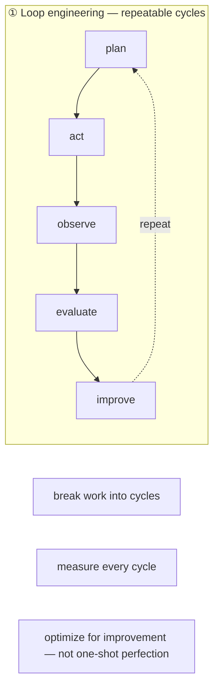

**Private Brain:** organism water-pipe + concert + heal ledger + day brief.

---

## 2 · What graph engineering is

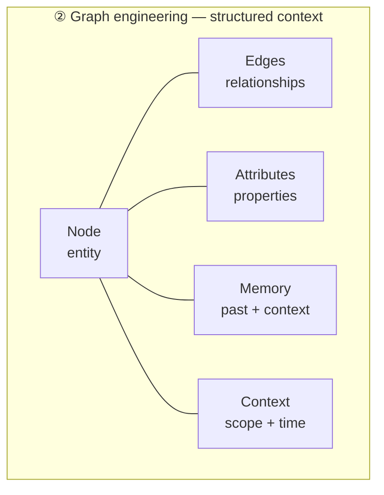

**Private Brain:** `.brain` nodes / edges / props / tiers / golden config.

---

## 3 · Two-model stack — who does what (US sovereign only)

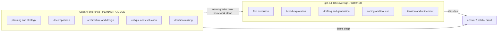

```text
rule of thumb: gpt-5.1 worker ships fast.
rule of thumb: gpt-5.1-high / enterprise-frontier-model thinks deep.
Corporate: edge sovereign · AWS gov-region-1 GSS when SHIM live.
```

---

## 4 · Core loop patterns that matter

```mermaid
flowchart TB
  subgraph L1["1 research loop"]
    direction LR
    r1[ask] --> r2[search] --> r3[synthesize] --> r4[critique] --> r5[refine]
  end
  subgraph L2["2 coding loop"]
    direction LR
    c1[spec] --> c2[plan] --> c3[code] --> c4[test] --> c5[fix] --> c6[repeat]
  end
  subgraph L3["3 content loop"]
    direction LR
    t1[idea] --> t2[draft] --> t3[edit] --> t4[publish] --> t5[learn]
  end
  subgraph L4["4 ops loop"]
    direction LR
    o1[monitor] --> o2[detect] --> o3[diagnose] --> o4[act] --> o5[review]
  end
```

**Never let a model grade its own homework** — critique / evaluate uses **judge** tier (separate role; GSS when available).

---

## 5 · Core graph patterns that matter

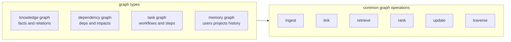

**Private Brain:** knowledge + structural nodes; ingest_bus · vector search · origin trails · quarantine rank.

---

## 6 · How loop + graph systems work together

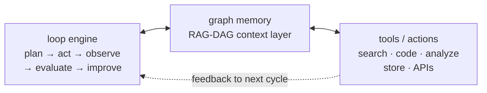

**Private Brain:** hooks + orchestrate + organism + kingdom keys (GitLab/Jira/Confluence/Corporate Package Index/AWS).

---

## 7 · Proper workflows people actually use

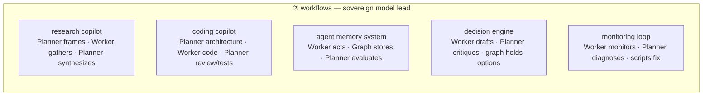

| Workflow | Worker (fast) | Planner / judge (deep) |
|----------|---------------|-------------------------|
| research | crawl / gather | synthesize · cite |
| coding | implement · test | plan · review |
| memory | write nodes | distill · golden |
| decision | options | pick + log |
| monitoring | metrics · heal | hard diagnose |

---

## 8 · Best practices + common mistakes

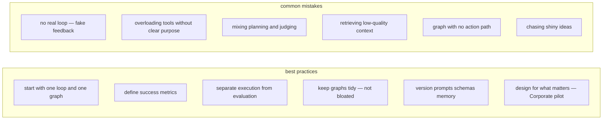

---

## 9 · What to measure + how to progress

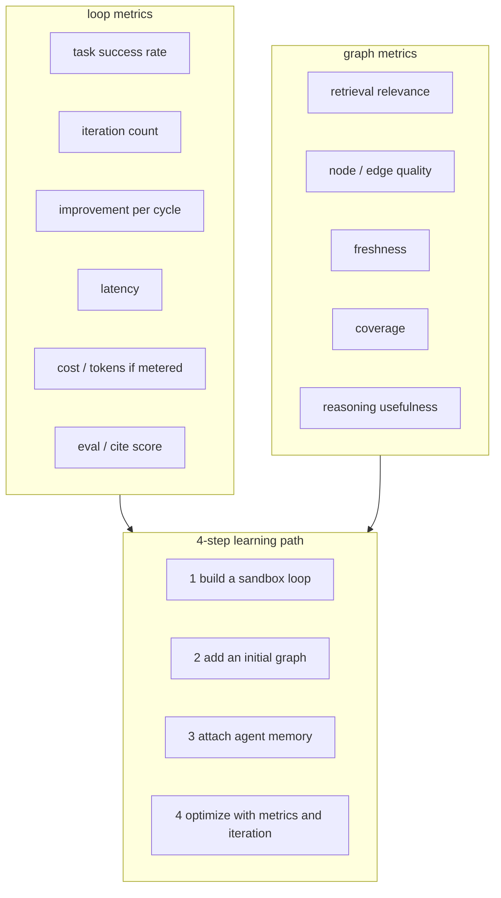

**Private Brain maps:** ops_metrics · fire_drill · purity · godseye fps · stress_rag · day brief.

---

## End-to-end workflow (full bar)

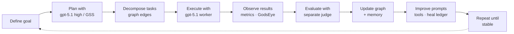

**Close the loop always.** Air-gap: day brief / phase-2 handoff → Grok parent offline (lab only).

---

## Master diagram (one canvas)

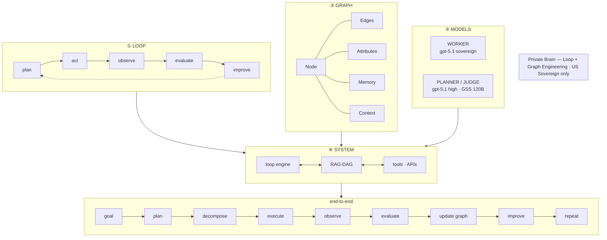

---

## Starter projects (from the diagram)

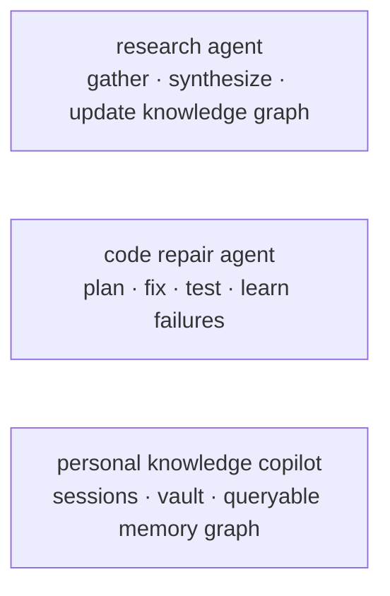

| Starter | Private Brain path |
|---------|-------------------|
| Research | concert + crawl + graph |
| Code repair | Codex beast + graph cites |
| Knowledge copilot | sessions ingest + golden + vault |

---

*Source shape: loop/graph one-pager. Model column: OpenAI US sovereign / enterprise only.*
