# Private Brain — Mermaid architecture diagrams
Source of truth extracted from `/Users/kevinnichols/private-brain-codex/README.md`.
Open this file in VS Code / GitHub / any Mermaid preview.

**Deps model:** Core RAG is stdlib. Optional packages (e.g. GodsEye) install from **Corporate Library / Protected Gateway** Corporate Package Index via `PIP_INDEX_URL` — **no prepackaged libraries** in the kit. Missing package → request onboard.

## Where on this machine
| Path | Role |
|------|------|
| `/Users/kevinnichols/private-brain-codex/README.md` | Full README with embedded mermaid (11 diagrams) |
| `~/.codex/private-brain/docs/MERMAID.md` | Diagrams-only (this file, live) |
| `~/private-brain-codex/docs/MERMAID.md` | Kit docs |
| `~/private-brain-codex/package/docs/MERMAID.md` | Package mirror |
| **`docs/LOOP_GRAPH_SOVEREIGN.md`** | **Loop + graph one-pager (US sovereign models only)** |

---

## Loop + Graph Engineering (US sovereign) — master canvas

Mirrors the “How to Master Loop Engineering + Graph Engineering” layout.  
**Worker = gpt-5.1 US sovereign · Planner/Judge = gpt-5.1 high / enterprise-frontier-model.** Full 9-panel breakdown: [`LOOP_GRAPH_SOVEREIGN.md`](./LOOP_GRAPH_SOVEREIGN.md).

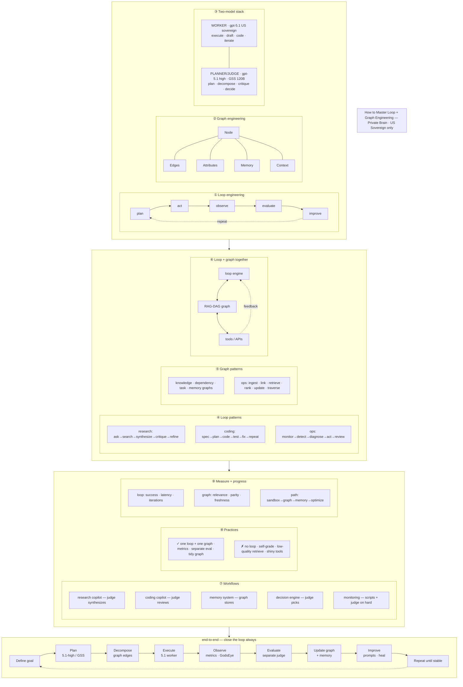

### End-to-end only (clean strip)

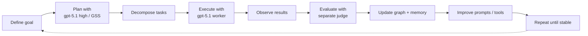

### Model stack only

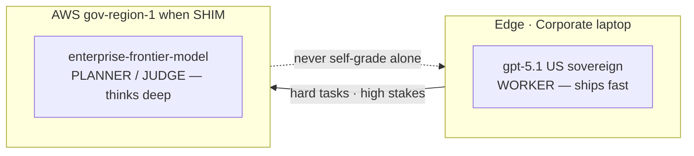

---

## Architecture (current)

```mermaid
flowchart TB
  subgraph You["You — zero Python"]
    BM["beastMode · SETUP · UNINSTALL · DAY1"]
  end

  subgraph Approved["Approved package sources — Corporate"]
    Corporate Library["Corporate Library Corporate Package Index"]
    Protected Gateway["Protected Gateway repos"]
    PIP["PIP_INDEX_URL / PIP_TRUSTED_HOST"]
    REQ["Request package onboard if missing"]
    Corporate Library --> PIP
    Protected Gateway --> PIP
    PIP -.-> REQ
  end

  subgraph Host["Codex host"]
    CX["ChatGPT.app → codex CLI"]
  end

  subgraph Edge["AppGate ZTNA"]
    AG["AppGate SDP"]
    SRC["GitLab · Jira · Confluence"]
    AG --> SRC
  end

  subgraph PB["~/.codex/private-brain sideload only"]
    direction TB
    H["hooks SessionStart / Prompt / Stop"]
    O["orchestrate.py concert DAG"]
    SW["agent_swarm shared topology"]
    LGH["LOOP → GRAPH → HARNESS"]
    SD["smart_discover sessions"]
    IB["ingest_bus"]
    IN["gitlab_ingest / ingest_url"]
    IC["internal_crawl_swarm polite multi-agent"]
    VM["vector_manager TF-IDF"]
    G[".brain nodes · edges · vectors"]
    AC["append-only audit chain"]
    ENT["enterprise quarantine · rank_evidence"]
    PUR["corpus purity · report_hash"]
    VAL["validate-enterprise · doctor · sap"]
    COC["config_of_config → DAY1 map"]
    V["vault IDENTITY · projects"]
    GE["GodsEye optional OpenGL free-universe"]
  end

  subgraph AWS["AWS gov-region-1 when enabled"]
    SSM["SSM port-forward → localhost"]
    LLM["GSS 120B · Nova Pro · Nova Mini"]
    RAG["OpenSearch + Neptune dual-write later"]
    SSM --> LLM
  end

  BM --> COC
  COC --> CX
  BM -->|exec -p beast-enterprise| CX
  BM -->|PIP_INDEX_URL from Corporate Library / Protected Gateway| Approved
  Approved -.->|optional pygame/PyOpenGL if in repo| GE
  BM -->|--swarm| SW
  BM -->|--enterprise| ENT
  BM -->|--validate-enterprise| VAL
  BM -->|--day1 / --config-of-config| COC
  BM -->|-GodsEye| GE
  BM -->|-ingestion / crawl| IN
  CX --> H
  H --> O
  O --> SW
  O --> LGH
  O --> SD
  O --> G
  O --> AC
  O --> ENT
  AG --> IN
  SRC --> IN
  IN --> IC
  IC --> IB --> G
  IB --> AC
  SD --> IB
  IB --> VM --> G
  SW --> G
  LGH --> G
  ENT --> G
  ENT --> PUR
  ENT --> AC
  PUR --> AC
  VAL --> SW
  VAL --> ENT
  VAL --> AC
  V --> CX
  GE -.-> G
  O -.-> GE
  CX -.->|PB_LLM_BASE_URL loopback| SSM
  G -.->|future dual-write| RAG
```

## Concert stage graph

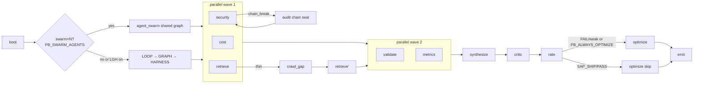

## Runtime path (one question)

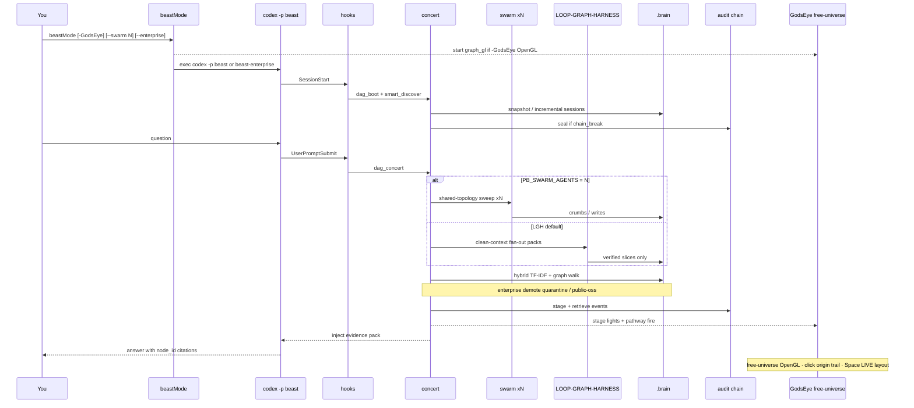

## Data plane

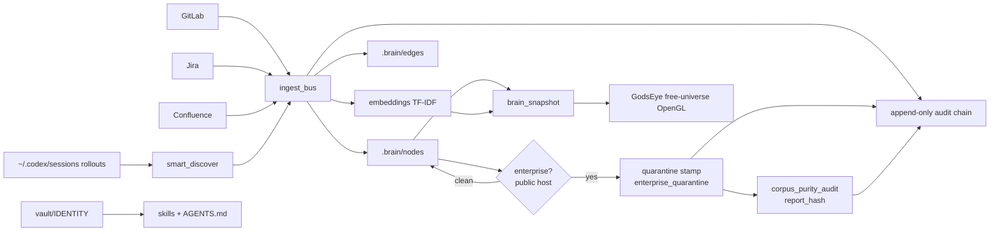

## Architecture (install + runtime)

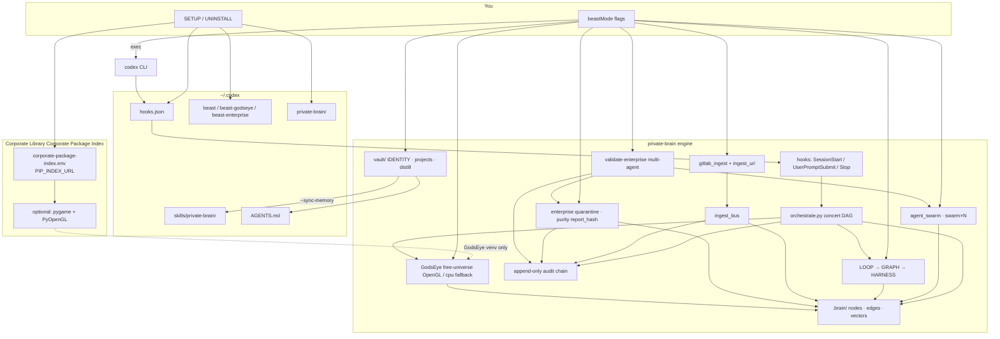

## Corporate Library / Protected Gateway Corporate Package Index (approved source)

```mermaid
flowchart LR
  ENV["corporate-package-index.env<br/>PIP_INDEX_URL · PIP_TRUSTED_HOST"] --> Corporate Library["Corporate Library Corporate Package Index<br/>approved PyPI remote"]
  Corporate Library --> CORE["Core RAG-DAG / concert / audit / enterprise<br/>stdlib only — no Corporate Package Index required"]
  Corporate Library --> GE["GodsEye free-universe OpenGL<br/>pygame + PyOpenGL + accelerate"]
  GE --> VENV["private-brain venv"]
  CORE --> ENGINE["hooks · orchestrate · swarm · LGH"]
  VENV --> GUI["-GodsEye graph_gl"]
  ENV -.->|PB_PIP_REQUIRE_CORPORATE_INDEX=1| GATE["block public PyPI"]
```

## Enterprise quarantine · purity · multi-agent validate

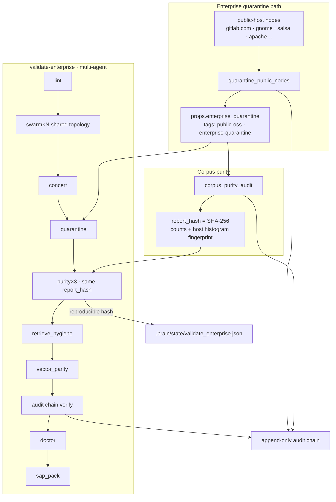

## Doctor

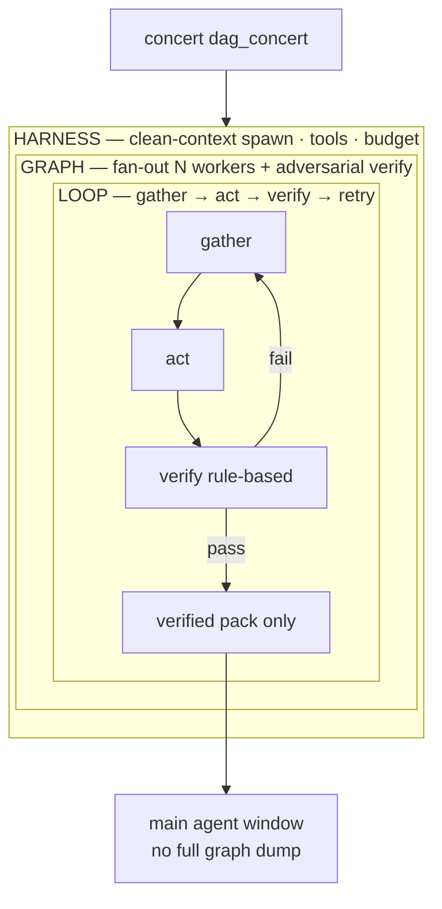

## Doctor

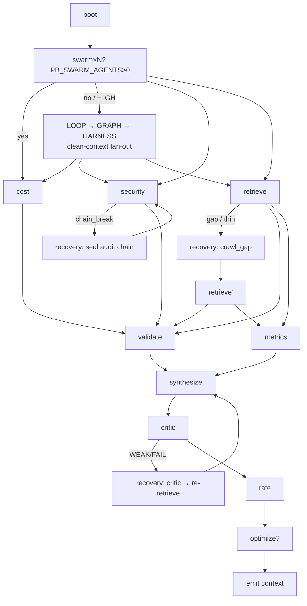

## Doctor

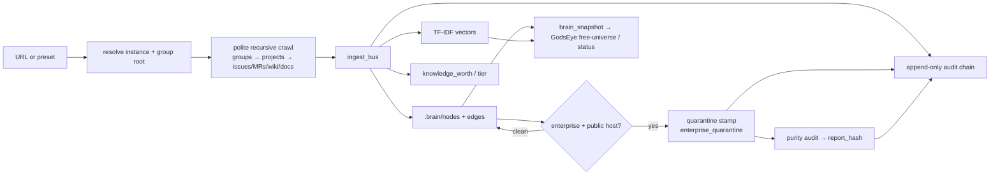

## Multi-source *light* public crawl

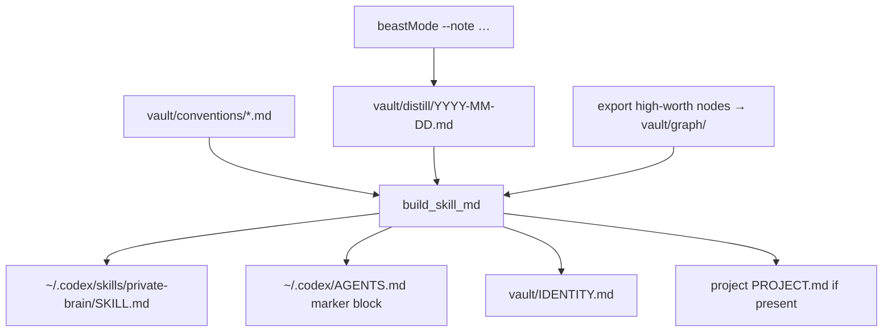

